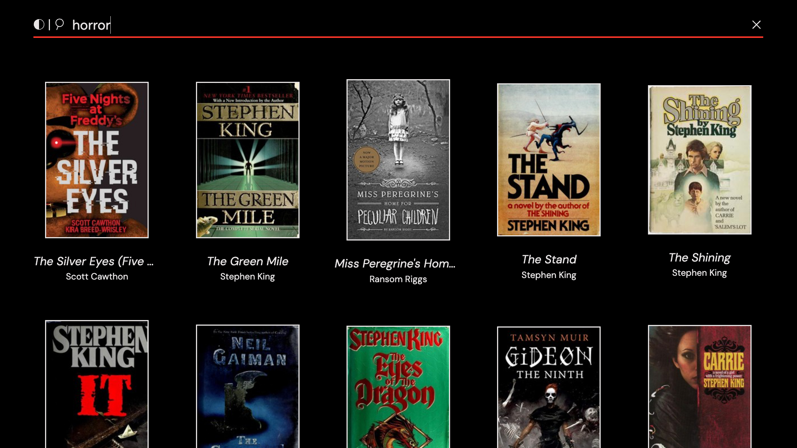

# Library

Link to the website ... [Library](https://if-library.netlify.app)

With this minimal website you can search for any book genre and read the various book informations like cover, title, author and description taken from [Open Library](https://openlibrary.org/)

## Buttons
- **moon icon**: if clicked can change the theme of the page in light or dark mode
- **magnifying glass icon**: if clicked searches for books
- **x icon in search bar**: it shows when start typing on the search bar field and it is used for cancel the text
- **x icon with a red circle**: is in the book description section and, if clicked, it takes you out and returns to the list of books

## Keyboard shortcuts
- **/ - Slash**: to focus on the search bar
- **⏎ - Enter**: to confirm the search
- **Esc - Escape**: to exit the book description window
